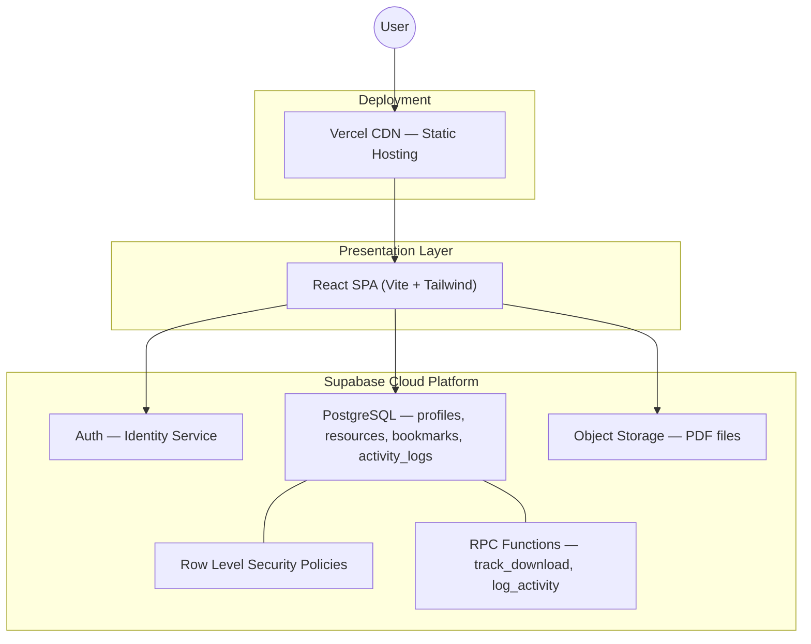

# Cloud Academic Resource Hub

A **cloud-native** academic resource management platform built with React and Supabase. Students upload, search, and download study materials; admins review uploads, manage users, and view platform analytics.


---

## Live Demo

>`https://academic-hub.vercel.app`

---

## Architecture



---

## Features

### Core (Phase 1)
- Email/password authentication (Supabase Auth)
- User registration with profile (branch, semester)
- PDF upload to cloud object storage
- Resource listing and download

### Phase 2
- Real-time search (title, subject, semester)
- User profile page with edit
- Bookmark system
- Improved dashboard and resource cards

### Phase 3A — RBAC & Approval
- Roles: **Student** / **Admin**
- Resource status: **Pending** → **Approved** / **Rejected**
- Admin review panel (approve, reject, delete)
- RLS-enforced visibility rules

### Phase 3B — Analytics & Admin
- Admin dashboard (platform stats)
- Analytics charts (Recharts)
- Activity feed (uploads, approvals, bookmarks, downloads)
- Download tracking per resource
- User management with search

---

## Tech Stack

| Layer | Technology |
|-------|------------|
| Frontend | React 18, Vite, Tailwind CSS, React Router |
| Charts | Recharts |
| Backend | Supabase (BaaS) |
| Database | PostgreSQL with RLS |
| Storage | Supabase Storage (PDF bucket) |
| Auth | Supabase Auth |
| Deployment | Vercel |

---

## Local Setup

### 1. Clone and install

```bash
git clone <your-repo-url>
cd academic-hub
npm install
```

### 2. Environment variables

```bash
cp .env.example .env
```


## Project Structure

```
src/
├── components/     # UI components (ResourceCard, Navbar, charts, etc.)
├── context/        # AuthContext
├── hooks/          # useBookmarks, useRole, useActivityFeed
├── lib/            # Utilities (activity, analytics, roles)
├── pages/          # Route pages (Dashboard, Admin*, Resources, etc.)
└── supabase.js     # Supabase client

supabase/
├── schema.sql      # Base schema
├── phase2.sql      # Bookmarks
├── phase3a.sql     # RBAC + approval
└── phase3b.sql     # Analytics + activity + downloads
```

---

---

## License

MIT — free to use for portfolio and learning.
