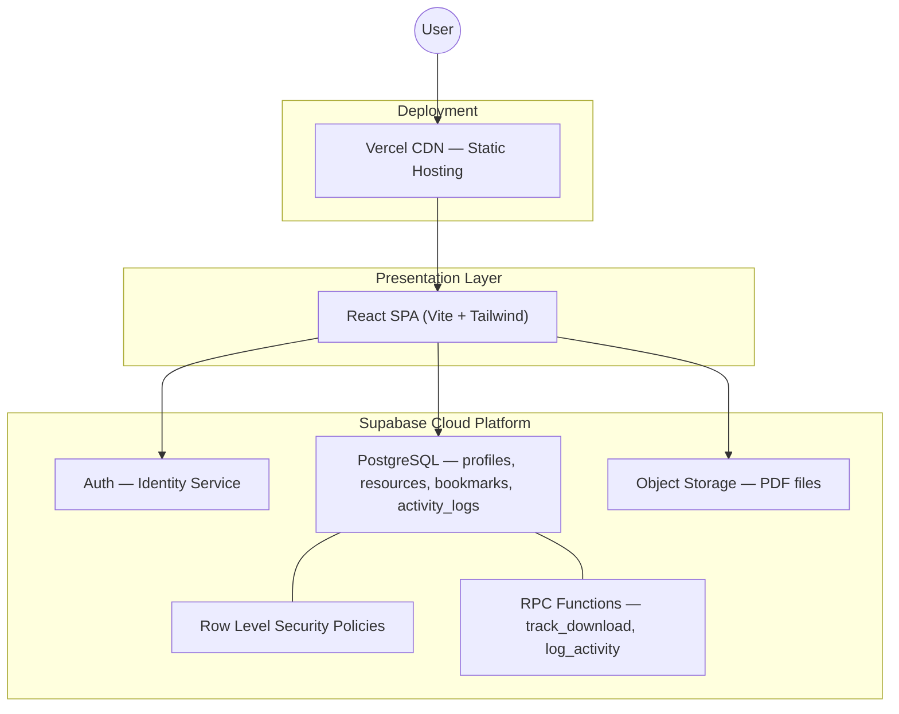

# Cloud Academic Resource Hub

A **cloud-native** academic resource management platform built with React and Supabase. Students upload, search, and download study materials; admins review uploads, manage users, and view platform analytics.

> **Resume highlight:** Multi-tier cloud architecture with managed auth, PostgreSQL (RLS), object storage, RBAC, approval workflows, and analytics.

---

## Live Demo

> Add your Vercel URL here after deployment, e.g. `https://academic-hub.vercel.app`

---

## Architecture



---

## Features

### Core (Phase 1)
- Email/password authentication (Supabase Auth)
- User registration with profile (branch, semester)
- PDF upload to cloud object storage
- Resource listing and download

### Phase 2
- Real-time search (title, subject, semester)
- User profile page with edit
- Bookmark system
- Improved dashboard and resource cards

### Phase 3A — RBAC & Approval
- Roles: **Student** / **Admin**
- Resource status: **Pending** → **Approved** / **Rejected**
- Admin review panel (approve, reject, delete)
- RLS-enforced visibility rules

### Phase 3B — Analytics & Admin
- Admin dashboard (platform stats)
- Analytics charts (Recharts)
- Activity feed (uploads, approvals, bookmarks, downloads)
- Download tracking per resource
- User management with search

---

## Tech Stack

| Layer | Technology |
|-------|------------|
| Frontend | React 18, Vite, Tailwind CSS, React Router |
| Charts | Recharts |
| Backend | Supabase (BaaS) |
| Database | PostgreSQL with RLS |
| Storage | Supabase Storage (PDF bucket) |
| Auth | Supabase Auth |
| Deployment | Vercel |

---

## Local Setup

### 1. Clone and install

```bash
git clone <your-repo-url>
cd academic-hub
npm install
```

### 2. Environment variables

```bash
cp .env.example .env
```

Fill in from **Supabase Dashboard → Project Settings → API**:

```env
VITE_SUPABASE_URL=https://xxxxx.supabase.co
VITE_SUPABASE_ANON_KEY=eyJhbGci...
```

### 3. Supabase database setup

Run these SQL files **in order** in **Supabase → SQL Editor**:

| Order | File | When |
|-------|------|------|
| 1 | `supabase/schema.sql` | New project only |
| 2 | `supabase/phase2.sql` | If bookmarks table missing |
| 3 | `supabase/phase3a.sql` | RBAC + approval workflow |
| 4 | `supabase/phase3b.sql` | Analytics + activity + downloads |

**Promote yourself to Admin:**

```sql
update public.profiles set role = 'Admin' where email = 'your-email@example.com';
```

**Disable email confirmation** (for development):  
Authentication → Providers → Email → turn off **Confirm email**

### 4. Run locally

```bash
npm run dev
```

Open `http://localhost:5173`

---

## Deploy to Vercel (Free)

1. Push this project to **GitHub**
2. Go to [vercel.com](https://vercel.com) → **Add New Project** → import repo
3. Framework preset: **Vite**
4. Add environment variables:
   - `VITE_SUPABASE_URL`
   - `VITE_SUPABASE_ANON_KEY`
5. Click **Deploy**

`vercel.json` is included for React Router SPA routing.

---

## Project Structure

```
src/
├── components/     # UI components (ResourceCard, Navbar, charts, etc.)
├── context/        # AuthContext
├── hooks/          # useBookmarks, useRole, useActivityFeed
├── lib/            # Utilities (activity, analytics, roles)
├── pages/          # Route pages (Dashboard, Admin*, Resources, etc.)
└── supabase.js     # Supabase client

supabase/
├── schema.sql      # Base schema
├── phase2.sql      # Bookmarks
├── phase3a.sql     # RBAC + approval
└── phase3b.sql     # Analytics + activity + downloads
```

---

## Resume Bullet Points

- Built a **cloud-native** academic platform using Supabase Auth, PostgreSQL, and object storage with **Row Level Security** policies
- Implemented **RBAC** (Student/Admin) and an **admin approval workflow** for uploaded resources
- Designed **analytics dashboard** with engagement metrics, download tracking, and real-time activity feed
- Deployed a **serverless React frontend** on Vercel with environment-based cloud configuration

---

## License

MIT — free to use for portfolio and learning.
